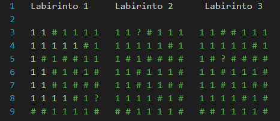

# Trabalho 3 - Labirinto(BFS e DFS)
Trabalho 3 de AEDS - Labirinto Randômico, por Largura(BFS) e Profundidade(DFS), implementado em C++
 

<div style="display: inline-block;">
 
 
 
<a href="https://github.com/mpiress/midpy/issues">


</a> 
</div>

<p> </p>
<p> </p>

<h2>  Introdução </h2>

<p> No mundo atual, é possível solucionar um mesmo problema através de diferentes formas, especialmente na área da programação. Com isso, o trabalho do Labirinto foi resolvido através de três formas distintas, visando testar qual labirinto irá percorrer a matriz com o menor tempo e também com o menor custo computacional.  </p>

* ``` Labirinto Randômico ```: O usuário seleciona uma posição da matriz, inserindo uma linha e uma coluna. A partir disso, o programa irá analisar as posições que não contenham um bloqueio de caminho para, depois, sortear uma posição para ser percorrida, até que se encontre o ponto de saída (?).

* ``` Labirinto por Profundidade(DFS) ```: O programa começa percorrendo a matriz a partir da primeira posição, e tende a seguir um caminho em linha reta, começando pela horizontal - direita. Caso não seja encontrado o ponto de saída (?), o sistema irá percorrer em linha reta até bater em uma parede, no qual será realizado o cálculo para caminhar em um percurso não realizado anteriormente.

* ``` Labirinto por Largura(BFS) ```: O programa começa percorrendo a matriz a partir da primeira posição, e logo depois pula para a segunda posição da linha, permanecendo na primeira coluna, até a segunda posição da coluna, na primeira posição da linha. O programa continua percorrendo nesse sentido diagonalmente, começando por baixo e terminando em cima até encontrar o ponto de saída (?). Caso haja alguma parede bloqueando o caminho diagonal, será realizado um novo caminho desviando da parede e voltando para a diagonal original. Ademais, se houver um perigo neste caminho. o proornar para a posição inicial.

<p align="center">

</p>

<br>
<h2>  Objetivo </h2>

<p> Para vencer o labirinto através das três formas de implementação de percurso, é necessário chegar ao ponto de saída (?) através de caminhos livres para passagem (1), no qual serão enfrentados bloqueios de caminhos, representados por paredes (#) e perigos (*), que retorna a pessoa para a posição inicial. 
  
<p> Uma vez testado a passagem pelos três labirintos, será analisado qual foi o método de passagem no labirinto que teve o menor tempo e o menor custo computacional. No final de cada teste, é apresentado os caminhos que foram percorridos e se o ponto de saída foi alcançado.

  
<p> </p> 
<h2>  Implementação </h2> 

* ``` Posição das matrizes ```: Foram representadas por uma struct "pos" que verifica a posição atual da matriz que está sendo percorrida. A struct foi utilizada nos três tipos de labirinto.

* ``` Labirinto Randômico ```: Foi necessário a utilização de apenas um vector implementado em uma classe para executar o Labirinto Randômico.

* ``` Labirinto por Profundidade(DFS) ```: Foi necessário apenas a utilização de um vector (caminho), implementado em uma classe, para realizar a implementação do Labirinto por Profundidade(DFS).

* ``` Labirinto por Largura(BFS) ```: Foram necessários a utilização de dois vectors e uma fila, implementados em uma classe, para realizar a implementação do Labirinto por Largura(BFS).

<h2>Arquivos </h2>

* ``` main.cpp ```: Arquivo e função principal do sistema que recebe os arquivos das classes dos três labirintos para execução do programa;
* ``` Labirinto.hpp ```: Arquivo que cria as funções utilizadas no labirinto randômico;
* ``` Labirinto.cpp ```: Arquivo que implementa as funções criadas no Labirinto.hpp;
* ``` LabirintoLarg.hpp ```: Arquivo que cria as funções utilizadas no labirinto por largura(BFS);
* ``` LabirintoLarg.cpp ```: Arquivo que implementa as funções criadas no LabirintoLarg.hpp;
* ``` LabirintoProf.hpp ```: Arquivo que cria as funções utilizadas no labirinto por profundidade(DFS);
* ``` LabirintoProf.cpp ```: Arquivo que implementa as funções criadas no LabirintoProf.hpp;
* ``` input.data ```: Contém os labirintos utilizados no programa;
* ``` output.data ```: Exibe o resultado do labirinto após ser percorrido.

<h2>Funções </h2>

<h3> Labirinto Randômico: </h3>

* ``` void ReadFile(); ```: Lê o arquivo que contém a matriz; 
* ``` int Tam(); ```: Lê o tamanho da matriz;
* ``` void WalkMatrix(); ```: Caminha pela matriz de forma aleatória. O sistema realiza um sorteio de 0 a 7 para obter a posição no qual a pessoa irá caminhar. Ela pode caminhar pelas oito posições detalhadas no tópico Movimentação. Com o número obtido, o sistema irá, através do switch case, realizar o caminhamento através do número sorteado;
* ``` void CamPerc(); ```: Esta função pega cada movimento realizado pela função WalkMatrix e demarca o caminho percorrido com "X" e o caminho não percorrido com "@". Logo depois, ela printa a matriz para mostrar o resultado final após o caminhamento pelo labirinto, indicando se o ponto final foi alcançado ou não.

<h3> Labirinto por Largura(BFS): </h3>

* ``` void ReadFile(); ```: Lê o arquivo que contém a matriz; 
* ``` int Tam(); ```: Lê o tamanho da matriz;
* ``` void WalkMatrix(); ```: Caminha pela matriz a partir de sua largura. Ela pega dois vectors fila e caminho, no qual fila são os caminhos que ainda serão acessados no labirinto e o caminho as posições já acessadas. Logo depois, o programa troca os sinais do labirinto para facilitar na hora de executar e no entendimento da função. A partir disso, o programa fixa uma posição e verifica: se for 1, a posição é colocada no vector de caminho; se for 0, a função acaba; se for -1 o dano vira caminho e os dois vectors são zerados. Na condição final, ele pega as posições em volta de uma posição fixada e coloca no vector fila para ser acessada;
* ``` void CamPerc(); ```: Esta função pega cada movimento realizado pela função WalkMatrix e demarca o caminho percorrido com "X" e o caminho não percorrido com "@". Logo depois, ela printa a matriz para mostrar o resultado final após o caminhamento pelo labirinto, indicando se o ponto final foi alcançado ou não.
* ``` bool VerFila(int i, int j); ```: Verifica e mostra a fila armazenada no vector fila;
* ``` bool VerCam(int i, int j); ```: Verifica e mostra o caminho armazenado no vector caminho.

<h3> Labirinto por Profundidade(DFS): </h3>

* ``` void ReadFile(); ```: Lê o arquivo que contém a matriz; 
* ``` int Tam(); ```: Lê o tamanho da matriz;
* ``` void WalkMatrix(); ```: Caminha pela matriz a partir de sua profundidade. Segue o mesmo princípio de vector e troca de sinais que o BFS, porém não é necessário a utilização de um vector fila. Na condição final, ela verifica se a próxima posição é uma posição acessível. Caso seja, ela continua seguindo em linha reta. Caso não seja, ela leva a uma outra condição que muda o direcionamento do caminho, sendo possíveis quatro direções: direita, esquerda, cima e baixo;
* ``` void CamPerc(); ```: Esta função pega cada movimento realizado pela função WalkMatrix e demarca o caminho percorrido com "X" e o caminho não percorrido com "@". Logo depois, ela printa a matriz para mostrar o resultado final após o caminhamento pelo labirinto, indicando se o ponto final foi alcançado ou não;
* ``` bool VerCam(int i, int j); ```: Verifica e mostra a fila armazenada no vector caminho.

<p>Também é possível executar o programa através do site de hospedagem de código, Replit, onde foi realizado a programação do código do "O Labirinto Recorrente": <link>https://replit.com/@OsBrabosSoltos/Trabalho-3-Labirinto#src/main.cpp</link></p>

# Comparação Randômico, Profundidade e Largura

Para realizar uma análise comparativa entre os métodos utilizamos 3 labirintos representados por matrizes 7x7 variando a distância do objetivo do ponto inicial e a disposição das paredes.
<p align="center">

</p>

## Randômico

O método randômico, embora tenha um desempenho variável, demonstra uma relação entre o tempo de execução e a distância entre o ponto de partida e o ponto de chegada no labirinto. Em outras palavras, quando o percurso é mais curto, espera-se uma média menor de passos para resolver o labirinto. Essa conclusão é baseada em dados gerados a partir de 50 execuções de cada labirinto, calculando posteriormente a média de desempenho.

**Matriz 1:** 45 passos </br>
**Matriz 2:** 6 passos </br>
**Matriz 3:** 13 passos </br>

## Profundidade 

O método de busca em profundidade (DFS) demonstra um desempenho superior quando o perfil do labirinto favorece a estratégia de busca em profundidade. No primeiro labirinto, é evidente que o DFS supera significativamente os métodos randômico e busca em largura (BFS), pois o trajeto inicial gerado já permite que o algoritmo resolva o labirinto de forma eficiente. No entanto, em certos casos, o algoritmo DFS pode apresentar desafios. Como o DFS explora um único ramo de busca até determinar se ele leva ao ponto final, se o objetivo estiver em um caminho paralelo inicialmente ignorado pelo algoritmo, como no caso do labirinto 2, o algoritmo terá que explorar todos os outros caminhos em sua lista de prioridades antes de voltar e refazer a busca no início do labirinto.

Em resumo, o método de busca em profundidade apresenta melhor desempenho quando o perfil do labirinto favorece sua estratégia, permitindo encontrar soluções de forma eficiente. No entanto, sua desvantagem é que pode ser necessário explorar todos os caminhos antes de encontrar a solução ideal em casos onde o caminho inicial não leva ao objetivo.

**Matriz 1:** 15 passos </br>
**Matriz 2:** 32 passos </br>
**Matriz 3:** 34 passos </br>

## Largura

O método de busca em largura (BFS) apresenta melhor desempenho para casos em que o caminho da solução diverge do percurso padrão do DFS, como no labirinto 2. Ao explorar todas as opções em uma camada antes de avançar para a próxima, o BFS é capaz de encontrar o caminho ideal mesmo quando o objetivo está em um caminho inicialmente ignorado pelo método de profundidade.

Resultados para as três matrizes utilizadas no teste.

**Matriz 1:** 35 passos </br>
**Matriz 2:** 3 passos </br>
**Matriz 3:** 6 passos </br>


## Imprimindo resultados:

* No fim de cada método, será impresso o o caminho percorrido pelo método selecionado.
* Também é possível selecionar a opção 4 que exibe uma comparação de desempenho entre os diferentes métodos.


# Conclusão

O custo computacional dos algoritmos de percorrimento de labirinto por profundidade e por largura depende do tamanho e complexidade do labirinto. O DFS pode ser mais eficiente em labirintos pequenos e simples, cujo o objetivo está convenientemente posicionado nos caminhos iniciais traçados pelo algoritmo, enquanto o BFS geralmente é mais eficiente em labirintos maiores e complexos, fornecendo uma solução ótima em termos de menor distância percorrida. O método randômico é o menos eficiente e possui um desempenho altamente variável.

<h2>Compilação e Execução do Programa</h2>

<p>Através do makefile, é posição utilizar comandos que realizam o processo de compilação e execução do programa. A seguir, temos alguns comandos que podem ser utilizados:</p><br>

* ``` make ```: Realiza a compilação do código por meio do gcc, no qual o resultado vai para a pasta build.</li><br>
* ``` make run ```: Executa o programa armazenado na pasta build após este ser compilado.</li><br>
* ``` make clean ```: Exclui a última compilação feita anteriormente na pasta build.</li><br><br>

# Referências

* ZIVIANI, N. Projeto De Algoritmos Com Implementações Em Pascal E C. 3. ed. São Paulo: Cengage Learning, 2011
* https://medium.com/analytics-vidhya/a-quick-explanation-of-dfs-bfs-depth-first-search-breadth-first-search-b9ef4caf952c

# Autores

<p>Daniel Couto Fonseca</p>
<p>João Marcos Silva Hess</p>
<p>Victor Ramos de Albuquerque Cabral</p>
